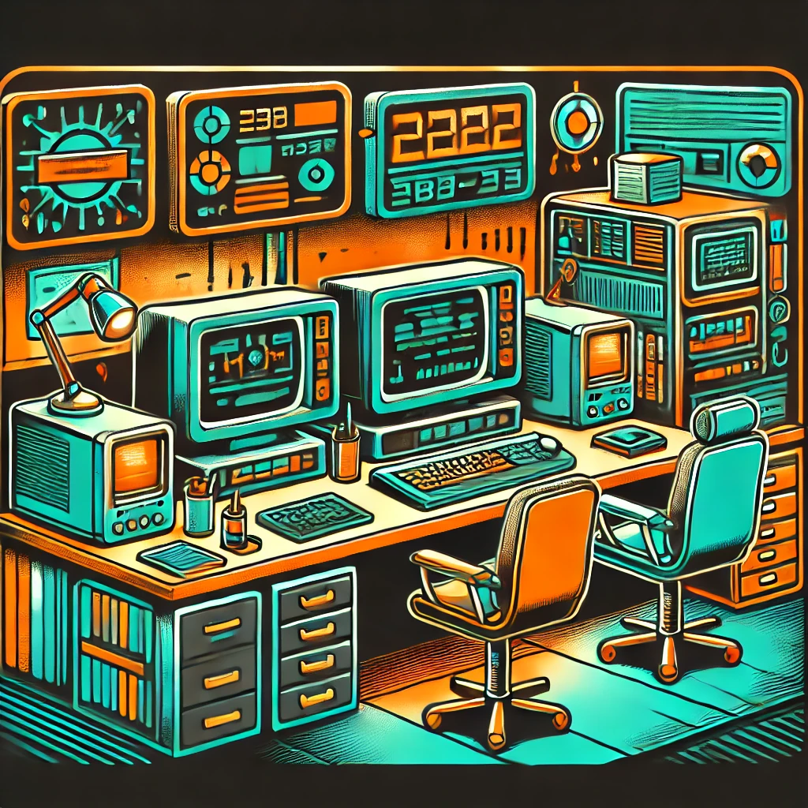

# Cybersecurity GitHub Portfolio

### [🏡 ErnieJohnson.ca Full Portfolio Web Site (click here)](https://www.erniejohnson.ca)

&nbsp;&nbsp;
---

Ernie has successfully assisted organisations across various sectors, ranging from small blogger businesses to large startups valued at over $650 million. His expertise spans industries such as technology, including IT hardware, electronics and programming. CIP experience spans highway  infrastructure, pipeline transportation infrastructure and most recently, smart city infrastructure. 

<BIG><b>Experience...</b></BIG>

- 12 years management in critical infrastructure protection (CIP)

- 8 years law enforcement  

- 3 years Canadian Forces (avionics)  

- Assisted organisations across various sectors from small blogger businesses to large startups valued at over $650M. Expertise spans industries such as technology, law enforcement, transportation and most recently, smart cities.   

- Expertise in public private partnership (P3) projects from $300M to $4.7B.  

<BIG><b>Certifications...</b></BIG>

- 2024 Cyber Security Analyst Diploma (Lighthouse Labs - in progress)

- 2024 Microsoft Cybersecurity Analyst Professional (Microsoft- in progress)

- 2024 Cyber Threat Intelligence (Antisyphon)

- 2024 Application Security Foundations Levels 2 & 3 (Semgrep Academy)

- 2023 Application Security Foundations Level 1 (Semgrep Academy)

- 2023 Cybersecurity Professional Certification (Google Career Certifications)

- 2022 Web Development Diploma (Lighthouse Labs)

- 2001 Performance Oriented Electronics Technician (Canadian Forces)

--- 
### Projects & Jobs Completed...
- [Lighthouse Labs - Cybersecurity Bootcamp - 2024](https://github.com/ej8899/cyber101/blob/main/lighthouse_labs_projects_completed/All%20Lighthouse%20Labs%20Cyber%20Projects.md)
- [Completed Jobs](https://github.com/ej8899/cyber101/blob/main/lighthouse_labs_projects_completed/All%20Lighthouse%20Labs%20Cyber%20Projects.md)
-  [Assorted Related puzzles](./puzzles/README.md)  

---

