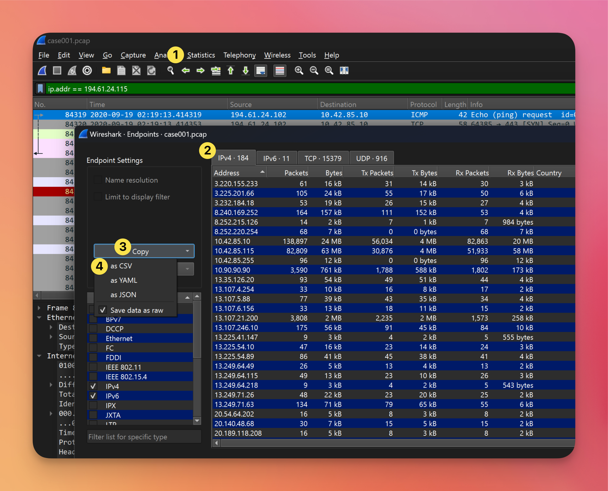
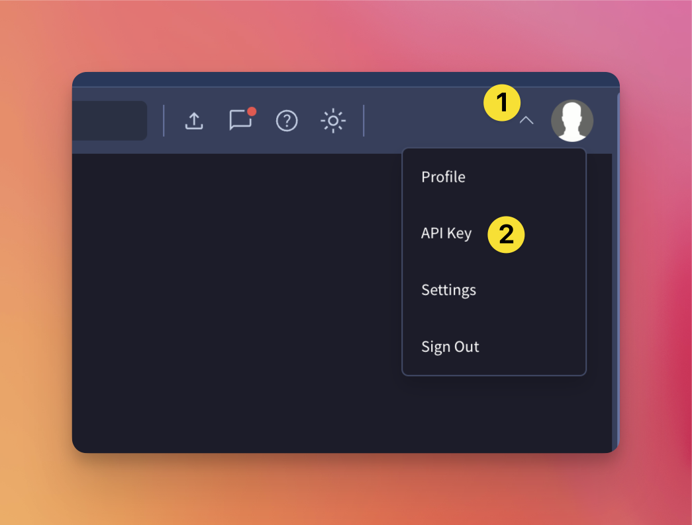
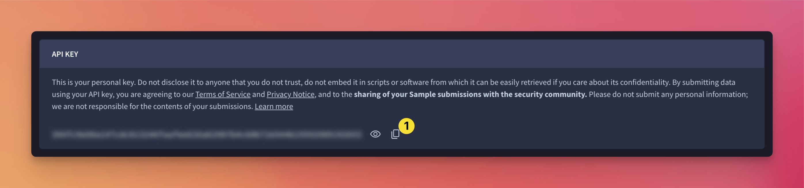
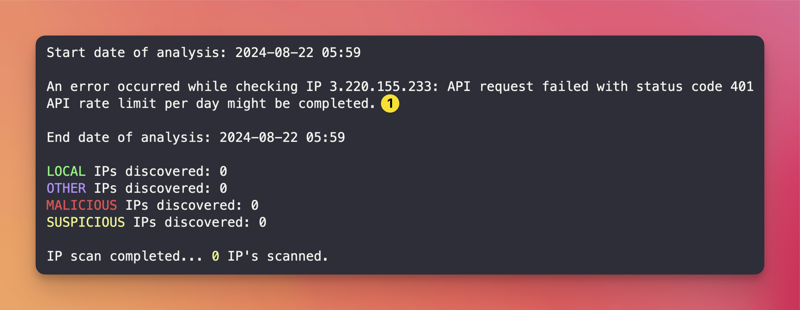

## VirusTotal Scan Automation Tool

<a href="https://erniejohnson.ca"></a>
<a href="mailto:ej8899@gmail.com" target="_blank"></a>&nbsp;<a href="https://www.linkedin.com/in/ernie-johnson/" target="_blank"></a>&nbsp;<a href="https://github.com/ej8899"></a>&nbsp;<a href="https://docs.google.com/document/d/1XCs8Z_gpaNc00l_rLoan0M1W8Td2Sg_DGThWnMTqOpc/edit?usp=sharing"></a>
---

### Overview
This Python script automates the scanning of a list of IPv4 addresses using the VirusTotal AP (v3).  The script then displays the results, including the IP address, scan results and a brief summary of the scan results.

### Contributing
If you'd like to contribute to this project, please feel free.  Fork this, make your changes, and submit a pull request.  Or just open an issue if you're asking for a new feature or have a bug report.
https://github.com/ej8899/cyber101/code/virustotal/issues

### Installation
To use this script, you'll need to install the following Python libraries:
```bash
pip install requests
```

### Usage
To use this script, you'll need to create a file called "ip_input.csv" in the same directory as the script.  This file should contain a list of IPv4 addresses, one per line.

You can copy Wireshark captures from Endpoints -> Copy -> As CSV and paste those directly into your input file.



Populate the code with your API key from https://www.virustotal.com/gui/  

You'll need to add it to the line
```python
apikey = 'YOUR_API_KEY_HERE'
```
Replacing YOUR_API_KEY_HERE with your actual API key (and leaving the single quotes).




Run the script using the following command:
```bash
python3 virustotal_scan.py
```

### Output Errors

A screen like above reprents a failed API call.  This is usually due to a bad API key or you've hit the API rate limits.  Check your API key and try again or wait for the next day if you've used your daily limit.

### Expected Output
Successful scan results will look like this:

And yes, this script is slow. The free VirussTotal API only allows 4 requests per minute so we have to use a delay to avoid hitting this rate limit.


### Future Plans
- pre-read the IP list and sort out local IP's first, providing an initial report of those IPs while the script works on the remaining
- ensure the initial count of IPs ignores local IP's to not take only the first 500 (rate limit) but to take the first 500 that are not local instead
- add a progress bar to show how many IPs have been scanned and how many are left
- improve upon output file formatting
- turn into a web application and allow links to the VirusTotal report for each IP (problem would be daily API limits for a singular key - or request users to enter their own key - although we could always cache results to help with this limit)


### Conclusion
This script automates the process of scanning a list of IPv4 addresses using the VirusTotal API.  It's a useful tool for network administrators and security professionals who need to quickly scan a large number of IP addresses for potential security threats.

### Contributors
- Ernie Johnson
- https://github.com/ej8899

### Original Code & Inspiration
https://github.com/ph1nx/VirusTotal-Bulk-IP-Scanner

### References
- [VirusTotal API Documentation](https://docs.virustotal.com/reference/overview)  
- [ErnieJohnson.ca](https://erniejohnson.ca)