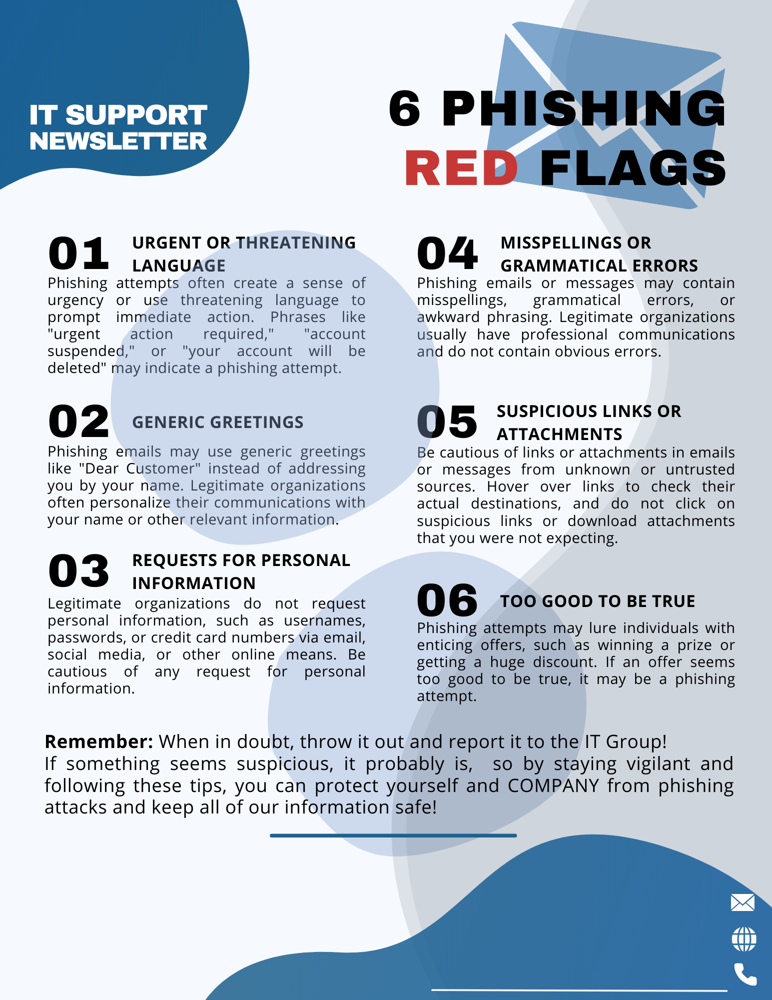

&nbsp;&nbsp;&nbsp;&nbsp;
---
### Training & Education Documents

I've created these training and education documents to help others learn about cybersecurity and network security.  These are typically used for internal company training and would get company branding applied prior to distribution.

For anyone looking to have these custom branded for your own company, please contact me for details, alternatively if you need materials custom created, please contact me for details as well.

---

<table border=1>

<tr>
<td width="250">

</td>
<td valign="top">
Added: 2024-08-27  
This document covers the basics of the Evil Twin attack and how to defend against it. 
  
<a href="./cybersecurity - EVIL TWIN - NO BRANDING.png" target=_new>click here</a>
</td>
</tr>

<tr>
<td width="250">

</td>
<td valign="top">
This document covers the differences between passwords and passphrases, and how to create strong, but yet easy to recall passphrases.  We also discuss weak passwords and how quickly they can be 'hacked'.
  
<a href="./NOBRAND cybersecurity - PASSWORD V PASSPHRASES.png" target=_new>click here</a>
</td>
</tr>

<tr>
<td width="250">

</td>
<td valign="top">
This document covers the Crowdstrike Windows computer 'crash' and the subsequent attacks that malicious actors started to utilize to capitalize on the media induced panic and fear of the situation.
  
<a href="./cybersecurity - crowdstrike attack.png" target=_new>click here</a>
</td>
</tr>

<tr>
<td width="250">

</td>
<td valign="top">
This document discusses common ClickFix type attacks and how to identify and prevent them.
  
We outline the importance of recognizing what you're clicking on and the red flags of these Click Fix attacks.
  
<a href="./cybersecurity - clickfix attack.png" target=_new>click here</a>
</td>
</tr>

<tr>
<td width="250">

</td>
<td valign="top">
This document discusses phishing attacks and how to identify and prevent them.  We outline six red flags to watch for in emails that can help users identify if the email is a phishing attempt or not.
  
<a href="./phishing.png" target=_new>click here</a>
</td>
</tr>

<tr>
<td width="250">

</td>
<td valign="top">
In this document we discuss the importance of using your cell phone provided Wifi "hotspot" or a VPN using company equipment and travelling.
  
<a href="./wifi security.png" target=_new>click here</a>
</td>
</tr>

<tr>
<td width="250">
</td>
<td valign="top">
</td>
</tr>

</table>